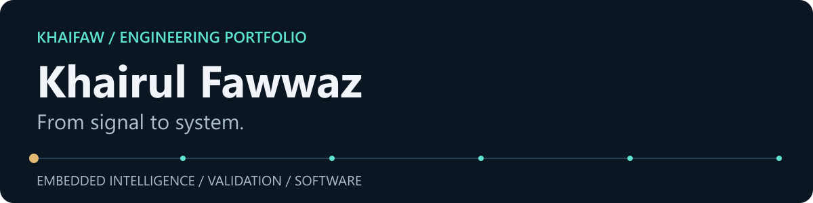

**Mechatronic Engineering graduate · Embedded systems, Edge AI and test automation**

I'm Fawwaz, a graduate of Universiti Sains Malaysia. I build across microcontroller firmware, signal processing and practical software, with an interest in making the whole system understandable and testable.

My final-year project connects microphone capture, MFCC features and an INT8 neural network on a Renesas RA8P1. More recent work explores reproducible PC validation and manufacturing data analysis.

## Selected engineering work

### 01 / Acoustic event detection · Final-year project

Recognising domestic sounds directly on a microcontroller. The firmware captures audio, computes MFCC, delta and delta-delta features, runs a six-class CNN and applies confidence thresholds and repeated-hit alert logic.

**Evidence:** 117,136-byte model; 39 × 61 input; 14/16 correctly classified windows in the historical board-recorded evaluation. That small split demonstrates feasibility; broader reliability still needs testing.

**C/C++ · RT-Thread · CMSIS-DSP · TensorFlow Lite Micro** 
Status: embedded prototype; public application-layer snapshot with a later LCD extension.

[Explore the FYP](https://github.com/KhaiFaw/ai-acoustic-event-detection) · [Core firmware](https://github.com/KhaiFaw/ai-acoustic-event-detection/blob/main/firmware/src/hal_entry.c) · [Evaluation figure](https://github.com/KhaiFaw/ai-acoustic-event-detection/blob/main/docs/images/confusion-matrix.png)

### 02 / PC Platform Validation Toolkit

Run bounded CPU, memory and storage checks against explicit requirements, then preserve results in SQLite and JSON, Markdown and HTML reports. Baselines compare compatible runs; an opt-in failure demo exercises the failure path.

**Evidence:** 66 automated tests; Windows and Ubuntu CI at the published MVP commit. Missing native or sensor capabilities are reported explicitly.

**Python · C++20 · pytest · SQLite** 
Status: functional MVP, version `0.1.0.dev0`; continued development.

[Inspect the toolkit](https://github.com/KhaiFaw/pc-platform-validation-toolkit) · [Verification scope](https://github.com/KhaiFaw/pc-platform-validation-toolkit/blob/main/docs/final-verification.md)

### 03 / Manufacturing yield and failure analysis

Turn 8,000 deliberately messy **synthetic** tester records into a normalized PostgreSQL model and Power BI dashboard. SQL handles cleaning, validation, quarantine, yield trends and failure analysis.

**Evidence:** four analytics views; 7,558 passes and 442 failures in the seeded dataset; real Power BI captures. These are generated scenarios, not production-factory results.

**PostgreSQL · SQL · Power BI · Python** 
Status: working portfolio demonstration using synthetic data.

[Explore the analysis](https://github.com/KhaiFaw/manufacturing-sql-yield-dashboard) · [Dashboard](https://github.com/KhaiFaw/manufacturing-sql-yield-dashboard/blob/main/docs/screenshots/Yield%20Overview.png)

### 04 / MyBudget · Supporting software project

A Windows budget application with exact decimal calculations, a separate domain layer and local SQLite storage. It covers planning, transactions, recurring income, goals and reports.

**Evidence:** 105 documented automated tests, successful Windows CI and a downloadable `v1.0.2` release. Screenshots use synthetic finances.

**C# · .NET · WinUI 3 · SQLite** 
Status: released; source-available under PolyForm Strict, with an unsigned portable build.

[Explore MyBudget](https://github.com/KhaiFaw/mybudget-windows) · [Release](https://github.com/KhaiFaw/mybudget-windows/releases/tag/v1.0.2)

## Technical strengths

- **Embedded intelligence:** sensor acquisition, C/C++ firmware, feature extraction and constrained model deployment.
- **Validation:** explicit requirements, bounded tests, capability checks and inspectable evidence.
- **Engineering software:** SQL data models, persistent applications and clear separation of responsibilities.

## How I work

Start with the physical problem and its constraints. Keep the data path visible. Test failure cases as well as the happy path, and document what the results do—and do not—establish.

Current focus: stronger hardware-independent checks for the FYP and repeatable evidence workflows across my projects.

Open to graduate and early-career opportunities in embedded software, test automation and engineering systems.

[LinkedIn](https://www.linkedin.com/in/khairulfawwaz) · [All repositories](https://github.com/KhaiFaw?tab=repositories)
