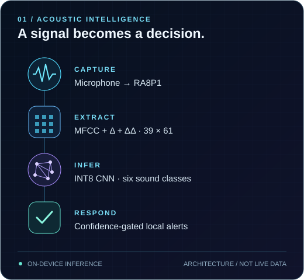

  

  <strong>Mechatronic Engineering graduate · Universiti Sains Malaysia</strong> 
  Building where physical systems, software and intelligence meet.

  
  
  
  

  <a href="https://www.linkedin.com/in/khairulfawwaz">LinkedIn</a> &nbsp;·&nbsp;
  <a href="https://github.com/KhaiFaw?tab=repositories">All repositories</a>

  

I'm **Fawwaz**, a Mechatronic Engineering graduate from **USM**. I work across microcontroller firmware, signal processing, on-device machine learning and practical engineering software. I enjoy connecting the pieces: a physical signal, a constrained device, a useful interface—and a clear way to test the result.

My **final-year acoustic detection project** is the starting point. The projects below extend that foundation into platform validation, manufacturing analytics and native Windows applications.

## Selected work

### 01 / On-device acoustic intelligence

<table>
  <tr>
    <td width="56%" valign="top">
      <h3>Listening at the edge.</h3>
      
<strong>Final-year project · Embedded Edge AI</strong>

      
Recognising six domestic sound categories directly on a <strong>Renesas RA8P1 Titan Board</strong>, without cloud inference.

      
Microphone capture → MFCC, delta and delta-delta features → INT8 CNN → confidence-gated alerts. An application-layer firmware snapshot connects signal processing with on-device inference and a later LCD extension.

      
<code>C/C++</code> <code>RT-Thread</code> <code>CMSIS-DSP</code> <code>TFLM</code>

      
<a href="https://github.com/KhaiFaw/ai-acoustic-event-detection"><strong>Explore the FYP →</strong></a> 
      <a href="https://github.com/KhaiFaw/ai-acoustic-event-detection/blob/main/firmware/src/hal_entry.c">Core firmware</a> · <a href="https://github.com/KhaiFaw/ai-acoustic-event-detection/blob/main/docs/images/confusion-matrix.png">Evaluation figure</a>

    </td>
    <td width="44%" align="center" valign="middle">
      
      
THE FLAGSHIP / SIGNAL → DECISION

    </td>
  </tr>
</table>

| Sound classes | Feature input | Embedded model | Historical board evaluation |
|:---:|:---:|:---:|:---:|
| **6** | **39 × 61** | **114.39 KiB** · INT8 | **14 / 16** windows |

Embedded prototype. The small historical split demonstrates feasibility, not broad reliability. A model-quantization correction is under <a href="https://github.com/KhaiFaw/ai-acoustic-event-detection/pull/1">draft review</a> and still needs board validation.

  

### 02 / PC platform validation

<table>
  <tr>
    <td width="44%" align="center" valign="middle">
      
      
ACTIVE BUILD / REQUIREMENTS → EVIDENCE

    </td>
    <td width="56%" valign="top">
      <h3>Test the system. Keep the evidence.</h3>
      
<strong>Functional MVP · Continued development</strong>

      
A requirements-based CLI for bounded CPU, memory and temporary-storage checks, capability discovery and telemetry.

      
Preserves runs in SQLite and JSON, Markdown and HTML reports. Compatible baselines support regression comparisons; a labelled fault-injection demo exercises the failure path.

      
<code>Python</code> <code>C++20</code> <code>pytest</code> <code>SQLite</code>

      
<a href="https://github.com/KhaiFaw/pc-platform-validation-toolkit"><strong>Inspect the toolkit →</strong></a> 
      <a href="https://github.com/KhaiFaw/pc-platform-validation-toolkit/blob/main/docs/final-verification.md">Verification scope</a> · <a href="https://github.com/KhaiFaw/pc-platform-validation-toolkit/blob/main/examples/measured/report.md">Measured report</a> · <a href="https://github.com/KhaiFaw/pc-platform-validation-toolkit/blob/main/examples/injected/report.md">Failure demo</a>

    </td>
  </tr>
</table>

| Automated tests | CI platforms | Captured run | Development stage |
|:---:|:---:|:---:|:---:|
| **66** | **Windows + Ubuntu** | **7 PASS · 1 WARN · 1 SKIP** | **0.1.0.dev0** |

Missing native or sensor capabilities are reported explicitly. Captured results describe one local run, not hardware certification or a benchmark ranking.

  

### 03 / Manufacturing data intelligence

<table>
  <tr>
    <td width="56%" valign="top">
      <h3>From tester data to engineering insight.</h3>
      
<strong>SQL + Power BI · Synthetic-data demonstration</strong>

      
Turn <strong>8,000 deliberately messy synthetic tester records</strong> into a validated PostgreSQL model and an interactive Power BI dashboard.

      
Preserve the raw source, clean and quarantine records, then expose reusable views for yield trends, failure analysis and station performance.

      
<code>PostgreSQL</code> <code>SQL</code> <code>Power BI</code> <code>Python</code>

      
<a href="https://github.com/KhaiFaw/manufacturing-sql-yield-dashboard"><strong>Explore the analysis →</strong></a> 
      <a href="https://github.com/KhaiFaw/manufacturing-sql-yield-dashboard/blob/main/docs/screenshots/Yield%20Overview.png">Dashboard</a> · <a href="https://github.com/KhaiFaw/manufacturing-sql-yield-dashboard/blob/main/docs/verification.md">Data verification</a>

    </td>
    <td width="44%" align="center" valign="middle">
      
      
DATA SYSTEMS / RAW RECORDS → INSIGHT

    </td>
  </tr>
</table>

| Synthetic records | Pass / fail | Analytics views | Verification |
|:---:|:---:|:---:|:---:|
| **8,000** | **7,558 / 442** | **4** | **Fresh load + rerun** |

Generated scenarios, not production-factory results. Dashboard images are real Power BI captures of this synthetic fixture.

  

### 04 / Local-first Windows software

<table>
  <tr>
    <td width="44%" align="center" valign="middle">
      
      
SUPPORTING PROJECT / LOGIC → EXPERIENCE

    </td>
    <td width="56%" valign="top">
      <h3>MyBudget. Your data stays local.</h3>
      
<strong>Native Windows application · Released</strong>

      
A monthly budget planner with exact decimal calculations and local SQLite storage. Covers planning, transactions, recurring income, goals and reports.

      
Separates the interface, domain rules and persistence, with automated tests and data-preserving migrations.

      
<code>C#</code> <code>.NET</code> <code>WinUI 3</code> <code>SQLite</code>

      
<a href="https://github.com/KhaiFaw/mybudget-windows"><strong>Explore MyBudget →</strong></a> 
      <a href="https://github.com/KhaiFaw/mybudget-windows/releases/tag/v1.0.2">Release</a> · <a href="https://github.com/KhaiFaw/mybudget-windows/blob/main/docs/verification.md">Verification</a>

    </td>
  </tr>
</table>

| Documented tests | Release | Persistence | Cloud dependency |
|:---:|:---:|:---:|:---:|
| **105** | **v1.0.2** | **Local SQLite** | **None** |

Source-available under PolyForm Strict; unsigned portable build. Screenshots use synthetic finances.

---

## Engineering range

| Layer | What I work with |
|:---|:---|
| **Sense & control** | Microcontrollers, sensor integration, C/C++, RT-Thread, peripheral interfaces |
| **Process & infer** | MFCC features, CMSIS-DSP, TinyML, TensorFlow Lite Micro, INT8 inference |
| **Test & explain** | Python, pytest, bounded workloads, telemetry, CI, inspectable reports |
| **Model & visualise** | PostgreSQL, SQL, Power BI, data validation, yield and failure analysis |
| **Build & deliver** | C#, .NET, WinUI 3, SQLite, structured application layers |

  
  
  
  
  

## How I build

**Understand the signal. Design around the constraints. Make the result inspectable.**

I like working across the hardware–software boundary: keeping the data path clear, testing failure cases, and documenting what a result does—and does not—establish. My current focus is stronger FYP verification and repeatable evidence workflows across my projects.

## Let's connect

Open to **graduate and early-career opportunities** in embedded software, Edge AI, test automation and engineering systems.

  <a href="https://www.linkedin.com/in/khairulfawwaz"><strong>LinkedIn ↗</strong></a>
  &nbsp;·&nbsp;
  <a href="https://github.com/KhaiFaw?tab=repositories"><strong>All repositories ↗</strong></a>

Sense precisely. Model clearly. Decide locally. Build reliably.

  

  

  <a href="https://github.com/KhaiFaw/KhaiFaw/blob/activity-output/PLAY.md"><strong>▶ Play animation</strong></a> 
  Opens the animated view, even with reduced motion enabled. No browser settings changed. 
  Public contributions · Refreshed weekly · Each node represents a day of building.

