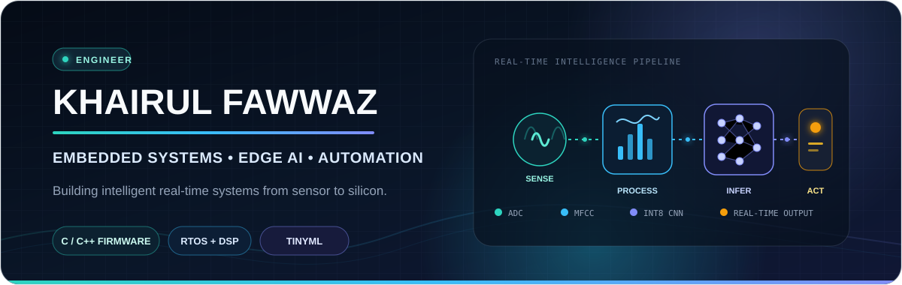

  

  
  

### Engineering reliable intelligence at the edge.

I'm a **Mechatronic Engineering graduate from Universiti Sains Malaysia (USM)** focused on embedded software, signal processing, Edge AI, and automation. I enjoy the point where hardware meets intelligence: capturing real-world signals, turning them into useful features, deploying compact models, and making the complete system behave reliably in real time.

My work spans **embedded C/C++**, RTOS-based firmware, sensor integration, TinyML, IoT connectivity, and hardware–software debugging. Here, I document the systems I build and the engineering lessons behind them.

---

## Featured engineering work

<table>
  <tr>
    <td width="58%" valign="top">
      <h3>AI-Powered Acoustic Event Detection</h3>
      
An embedded Edge AI system that classifies six domestic sound categories directly on a <strong>Renesas RA8P1 Titan Board</strong>—without cloud inference.

      
The firmware captures microphone audio, extracts MFCC, delta, and delta-delta features, runs an INT8 convolutional neural network with TensorFlow Lite for Microcontrollers, and produces confidence-gated real-time alerts.

      
<code>Embedded C/C++</code> <code>RT-Thread</code> <code>CMSIS-DSP</code> <code>TinyML</code> <code>TFLM</code>

      
<a href="https://github.com/KhaiFaw/ai-acoustic-event-detection"><strong>Explore the firmware and technical breakdown →</strong></a>

    </td>
    <td width="42%" align="center" valign="middle">
      
    </td>
  </tr>
</table>

| On-device classes | Feature pipeline | Model footprint | Evaluation |
|:---:|:---:|:---:|:---:|
| **6** sound categories | **39 × 61** MFCC-derived features | **114.4 KB** INT8 model | **87.5%** on a small board-recorded test split |

> The project demonstrates the full embedded ML path: data capture, DSP, model deployment, memory-aware inference, confidence handling, and live device output.

---

## Engineering toolkit

| Area | Technologies and capabilities |
|---|---|
| **Embedded systems** | C, C++, microcontrollers, RTOS concepts, firmware architecture, peripheral and sensor integration |
| **Edge AI & DSP** | TensorFlow Lite Micro, TinyML, CNNs, MFCC feature extraction, CMSIS-DSP, quantized inference |
| **Connectivity** | MQTT, UART, LTE AT commands, Wi-Fi, OTA update workflows |
| **Automation** | PLC Ladder Logic, control systems, MATLAB/Simulink |
| **Development** | RT-Thread Studio, VS Code, Keil µVision, Git/GitHub, Python |

  
  
  
  
  
  

---

## Experience

### Embedded Systems Intern · Innowave LLC

- Developed and optimized microcontroller-based embedded systems.
- Integrated sensors and supported hardware–firmware debugging.
- Worked with MQTT, LTE communication, and OTA update workflows.
- Built practical experience connecting physical devices to reliable software services.

### Bachelor of Mechatronic Engineering · Universiti Sains Malaysia

A multidisciplinary foundation spanning electronics, embedded programming, control, automation, mechanical systems, and intelligent system design.

---

## Other engineering work

| Project | Engineering focus |
|---|---|
| **Legged line-following robot** | Arduino-based sensing, locomotion, and closed-loop path following |
| **Hand-hygiene monitoring system** | PLC-controlled automation and process monitoring |
| **Height-measurement device** | RISC-V and 8052 embedded implementation |
| **FPGA passcode alarm** | Digital logic, state-based control, and hardware implementation |
| **Personal contact directory** | C++ file-based CRUD application and structured data handling |

These projects are being cleaned up and documented for future public releases.

---

## What I'm working toward

- Building production-minded embedded and Edge AI systems.
- Improving real-time firmware architecture, testing, and documentation.
- Publishing more engineering projects and technical write-ups.
- Exploring graduate and entry-level opportunities in embedded systems, Edge AI, automation, and related engineering roles.

---

## Let's connect

If you're working on embedded intelligence, real-time firmware, IoT, or automation, I'd be glad to connect.

  <a href="https://www.linkedin.com/in/khairulfawwaz"><strong>LinkedIn</strong></a>
  &nbsp;·&nbsp;
  <a href="https://github.com/KhaiFaw/ai-acoustic-event-detection"><strong>Featured project</strong></a>

Building systems that sense, decide, and act.
