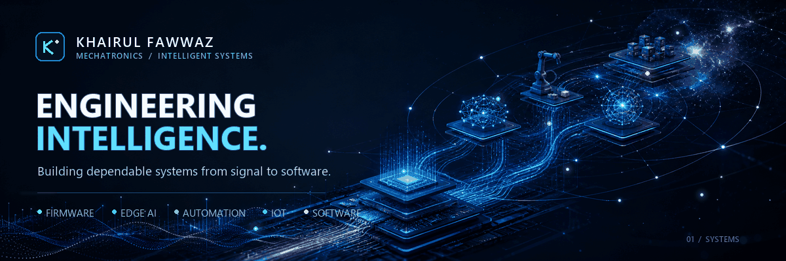

  

  
  
  

  

I'm a **Mechatronic Engineering graduate from Universiti Sains Malaysia (USM)** who builds where hardware, software, data, and intelligence meet. My work moves between real-time firmware, signal processing, on-device machine learning, connected devices, manufacturing analytics, automation, and native application development.

I care about the full engineering path: understanding the physical signal or production data, choosing a practical architecture, working within real constraints, and leaving behind a system that can be tested, explained, and improved.

---

## Selected work

<table>
  <tr>
    <td width="44%" align="center" valign="middle">
      
    </td>
    <td width="56%" valign="top">
      <h3>01 / Manufacturing data intelligence</h3>
      
An end-to-end production-test analytics system that turns <strong>8,000 deliberately messy tester records</strong> into validated manufacturing insights and an interactive Power BI dashboard.

      
PostgreSQL preserves the raw source, cleans and quarantines records, enforces a normalized production model, and exposes reusable analytics views for yield, Pareto, station performance, and trend analysis.

      
<code>PostgreSQL</code> <code>Advanced SQL</code> <code>Power BI</code> <code>Python</code> <code>Docker</code>

      
<a href="https://github.com/KhaiFaw/manufacturing-sql-yield-dashboard"><strong>Explore the data model, SQL analysis, and dashboards →</strong></a>

    </td>
  </tr>
</table>

| Test records | First-pass yield | Analytics contract | PBIR validation |
|:---:|:---:|:---:|:---:|
| **8,000** | **94.48%** | **4** reusable views | **0** errors |

 

<table>
  <tr>
    <td width="56%" valign="top">
      <h3>02 / On-device acoustic intelligence</h3>
      
A complete embedded Edge AI pipeline that recognizes six domestic sound categories directly on a <strong>Renesas RA8P1 Titan Board</strong>—without cloud inference.

      
The firmware captures microphone audio, extracts MFCC, delta, and delta-delta features, runs an INT8 convolutional neural network through TensorFlow Lite for Microcontrollers, and produces confidence-gated alerts in real time.

      
<code>Embedded C/C++</code> <code>RT-Thread</code> <code>CMSIS-DSP</code> <code>TinyML</code> <code>TFLM</code>

      
<a href="https://github.com/KhaiFaw/ai-acoustic-event-detection"><strong>Explore the firmware and technical breakdown →</strong></a>

    </td>
    <td width="44%" align="center" valign="middle">
      
    </td>
  </tr>
</table>

| Sound classes | Feature pipeline | Model footprint | Board-recorded evaluation |
|:---:|:---:|:---:|:---:|
| **6** | **39 × 61** MFCC-derived features | **114.4 KB** INT8 model | **87.5%** on a small test split |

 

<table>
  <tr>
    <td width="44%" align="center" valign="middle">
      
    </td>
    <td width="56%" valign="top">
      <h3>03 / Local-first Windows software</h3>
      
<strong>MyBudget</strong> is a native Windows monthly budget planner designed around private, PC-local data. It handles planning, transactions, recurring income and bills, savings goals, investments, reporting, backup, and CSV exchange.

      
The codebase separates UI, budget rules, and persistence; uses exact decimal money calculations; and includes data-preserving SQLite migrations plus automated verification.

      
<code>C# 14</code> <code>.NET 10</code> <code>WinUI 3</code> <code>MVVM</code> <code>SQLite</code>

      
<a href="https://github.com/KhaiFaw/mybudget-windows"><strong>See the architecture, screenshots, and verified build →</strong></a>

    </td>
  </tr>
</table>

| Native screens | Automated tests | Data model | Cloud dependency |
|:---:|:---:|:---:|:---:|
| **8** | **105** | Local SQLite | **None** |

---

## Engineering range

| Domain | What I build with |
|---|---|
| **Embedded systems** | C, C++, microcontrollers, RTOS concepts, firmware architecture, peripheral and sensor integration |
| **Edge AI & signal processing** | TensorFlow Lite Micro, TinyML, CNNs, MFCC feature extraction, CMSIS-DSP, quantized inference |
| **Manufacturing analytics** | PostgreSQL, advanced SQL, Power BI, data modeling, quality validation, yield and failure analysis |
| **Automation & control** | PLC Ladder Logic, control systems, MATLAB, Simulink |
| **Connected devices** | MQTT, UART, LTE AT commands, Wi-Fi, OTA update workflows |
| **Application software** | C#, .NET, WinUI 3, XAML, MVVM, SQLite, Python |

  
  
  
  
  
  
  
  
  
  
  

---

## Experience & foundation

<table>
  <tr>
    <td width="50%" valign="top">
      <h3>Embedded Systems Intern</h3>
      
<strong>Innowave LLC</strong>

      <ul>
        <li>Developed and optimized microcontroller-based embedded systems.</li>
        <li>Integrated sensors and supported hardware–firmware debugging.</li>
        <li>Worked with MQTT, LTE communication, and OTA update workflows.</li>
        <li>Connected physical devices to dependable software services.</li>
      </ul>
    </td>
    <td width="50%" valign="top">
      <h3>Bachelor of Mechatronic Engineering</h3>
      
<strong>Universiti Sains Malaysia</strong>

      
A multidisciplinary foundation across electronics, embedded programming, control, automation, mechanical systems, and intelligent system design.

      
That mix still shapes how I work: system-first, evidence-led, and comfortable crossing hardware–software boundaries.

    </td>
  </tr>
</table>

### Earlier engineering builds

| System | Engineering focus |
|---|---|
| **Legged line-following robot** | Arduino sensing, locomotion, and closed-loop path following |
| **Hand-hygiene monitoring system** | PLC-controlled automation and process monitoring |
| **Height-measurement device** | RISC-V and 8052 embedded implementation |
| **FPGA passcode alarm** | Digital logic, state-based control, and hardware implementation |

---

## Current trajectory

- Building production-minded embedded and Edge AI systems.
- Applying SQL and Power BI to manufacturing yield, failure, and process data.
- Strengthening real-time firmware architecture, testing, and documentation.
- Expanding into well-structured application software and AI-assisted engineering workflows.
- Publishing project evidence—not just finished screenshots, but architecture, constraints, verification, and lessons learned.

---

## Connect

I'm open to graduate and entry-level opportunities across embedded systems, Edge AI, manufacturing analytics, automation, IoT, and adjacent software engineering.

  <a href="mailto:khairulfaw@gmail.com"><strong>Email</strong></a>
  &nbsp;·&nbsp;
  <a href="https://www.linkedin.com/in/khairulfawwaz"><strong>LinkedIn</strong></a>
  &nbsp;·&nbsp;
  <a href="https://github.com/KhaiFaw?tab=repositories"><strong>Repositories</strong></a>

Sense precisely. Model clearly. Decide locally. Build reliably.

 

---

  

